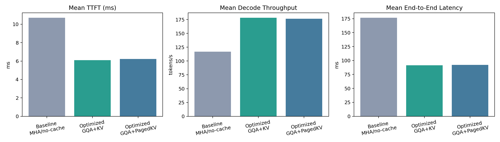
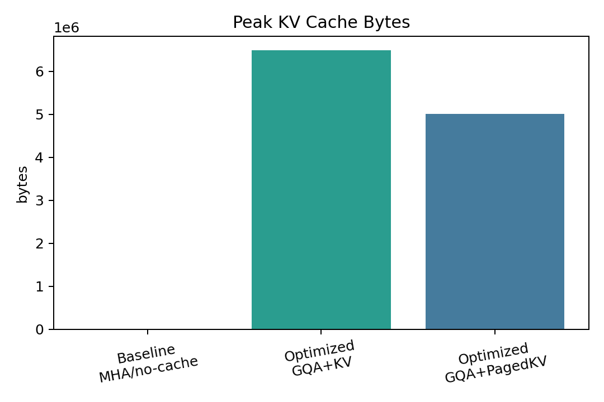

# TokenDock

## 초록

`TokenDock`은 대규모 언어모델의 답변 품질이 아니라, **서빙 경로 자체의 효율**만을 측정하기 위한 실험용 프로젝트다. 이 레포는 `MHA + no-cache` baseline과, `GQA + KV cache`, `GQA + PagedAttention-style block KV cache` 경로를 비교한다. Apple Silicon / MPS 환경에서 `vLLM`의 핵심 아이디어를 직접 재현 가능한 범위로 축소해 실험했으며, 최종 결과는 `TTFT`, `token/s`, `end-to-end latency`, `peak KV memory` 중심의 JSON과 PNG 시각화로 출력된다.

## 1. 문제 정의

실서비스 LLM 추론에서는 다음 병목이 반복적으로 등장한다.

- 매 토큰 생성 시 과거 prefix를 다시 계산하는 비효율
- 긴 문맥과 multi-turn 세션에서 커지는 KV cache 메모리 사용량
- KV cache를 단순 연속 버퍼로 관리할 때 발생하는 메모리 압박

이 프로젝트는 위 문제를 각각 다음 기법으로 대응한다.

- `GQA`
  - KV head 수를 줄여 attention 서빙 비용 완화
- `KV cache`
  - prefix 재계산 제거
- `PagedAttention-style block KV management`
  - KV 메모리를 고정 크기 block 단위로 관리

## 2. 접근 방법

직접적인 `vLLM + CUDA` 재현은 현재 머신 제약상 비현실적이므로, 이 레포는 **toy dense transformer serving lab** 방식으로 설계됐다.

비교한 세 엔진:

- `baseline_mha_no_cache`
  - vanilla MHA
  - prefix 매 step 재계산
  - KV cache 없음
- `gqa_contiguous_cache`
  - GQA
  - persistent KV cache
  - contiguous KV buffer
- `gqa_paged_cache`
  - GQA
  - persistent KV cache
  - paged/block KV manager

핵심 구현 파일:

- 엔진 구현: [engines.py](/Users/drlee/workspace/dev/tokendock/tokendock/engines.py)
- 워크로드 정의: [workload.py](/Users/drlee/workspace/dev/tokendock/tokendock/workload.py)
- 벤치마크 러너: [benchmark.py](/Users/drlee/workspace/dev/tokendock/tokendock/benchmark.py)
- 시각화: [plots.py](/Users/drlee/workspace/dev/tokendock/tokendock/plots.py)

## 3. 실험 설정

실행 환경:

- device: `Apple Silicon / MPS`
- framework: `PyTorch`
- 모델:
  - `hidden_size = 256`
  - `layers = 6`
  - `query heads = 8`
  - `KV heads = 2`
  - `max_seq_len = 1024`

측정 지표:

- `TTFT`
- `decode tokens/s`
- `end-to-end latency`
- `peak KV bytes`

실행 명령:

```bash
cd ~/workspace/dev/tokendock
uv sync
uv run src/benchmark.py
uv run src/plot_results.py
```

## 4. 벤치마크 워크로드

이 프로젝트는 단일 턴이 아니라 **multi-turn 세션**을 사용한다. 각 세션은 이전 문맥을 계속 유지해야 하도록 길게 설계돼 있으며, cache reuse의 효과가 드러나도록 구성했다.

예시 세션 유형:

- 수조 관찰 및 이벤트 추론 세션
- 프로젝트/운영 로그 요약 세션
- 공급망/창고 이상 탐지 세션
- 시스템 지연/재시도 원인 분석 세션

전체 질문 원문은 결과 JSON의 아래 필드에 들어 있다.

- [benchmark_results.json](/Users/drlee/workspace/dev/tokendock/results/benchmark_results.json)
  - `workload.sessions`

## 5. 정량 결과

최신 결과 JSON:

- [benchmark_results.json](/Users/drlee/workspace/dev/tokendock/results/benchmark_results.json)

핵심 비교 결과:

- baseline 대비 `GQA + contiguous KV cache`
  - `TTFT` `45.908%` 개선
  - `tokens/s` `56.548%` 개선
  - `total latency` `50.819%` 개선

- baseline 대비 `GQA + paged KV cache`
  - `TTFT` `44.134%` 개선
  - `tokens/s` `50.504%` 개선
  - `total latency` `48.772%` 개선

- `gqa_paged_cache` vs `gqa_contiguous_cache`
  - peak KV memory `22.727%` 감소
  - throughput/latency는 비슷하지만 메모리 압박은 더 낮음

## 6. 시각화

### 그림 1. 지연 시간과 처리량 비교



그림 파일:
- [latency_throughput.png](/Users/drlee/workspace/dev/tokendock/assets/latency_throughput.png)

해석:
- 두 최적화 경로 모두 baseline보다 `TTFT`와 `end-to-end latency`가 낮다
- `tokens/s`도 baseline보다 높다
- 즉 cache와 GQA 조합만으로도 서빙 지표 개선이 분명하다

### 그림 2. KV 메모리 사용량 비교



그림 파일:
- [kv_memory.png](/Users/drlee/workspace/dev/tokendock/assets/kv_memory.png)

해석:
- contiguous cache 대비 paged/block cache가 peak KV bytes를 더 낮춘다
- 즉 PagedAttention-style block 관리의 이점은 여기서 메모리 효율로 관측된다

## 7. 해석

이 실험에서 가장 중요한 포인트는 다음 두 가지다.

1. `GQA + KV cache`는 baseline 대비 **속도 지표를 직접 개선**했다
   - prefix 재계산 제거 효과가 큼
   - KV head 축소로 attention 서빙 비용도 낮아짐

2. `PagedAttention-style block management`는 contiguous cache 대비 **메모리 효율을 추가로 개선**했다
   - 절대 속도는 contiguous cache와 큰 차이가 없을 수 있음
   - 하지만 메모리 압박이 낮아지므로 긴 문맥/높은 동시성으로 갈수록 가치가 커진다

즉 결론은:

- `GQA + KV cache`는 서빙 성능 자체를 개선했고
- `PagedAttention-style` block KV 관리는 메모리 효율을 추가로 개선했다

## 8. 한계

- 공개 ~2B 모델 + 실제 vLLM CUDA 커널 경로를 그대로 재현한 것은 아님
- 현재 환경이 Apple Silicon / MPS라서, 실험은 재현 가능한 dense transformer fallback으로 구성됨
- 따라서 수치는 production GPU serving의 절대값이 아니라 **구조적 비교 실험 결과**로 해석해야 함

## 9. 재현 산출물

결과물:

- JSON:
  - [benchmark_results.json](/Users/drlee/workspace/dev/tokendock/results/benchmark_results.json)
- PNG:
  - [latency_throughput.png](/Users/drlee/workspace/dev/tokendock/assets/latency_throughput.png)
  - [kv_memory.png](/Users/drlee/workspace/dev/tokendock/assets/kv_memory.png)

## 10. 참고 문헌

- vLLM / PagedAttention paper: https://arxiv.org/abs/2309.06180
- vLLM blog: https://vllm.ai/blog/vllm
- GQA paper: https://arxiv.org/abs/2305.13245
