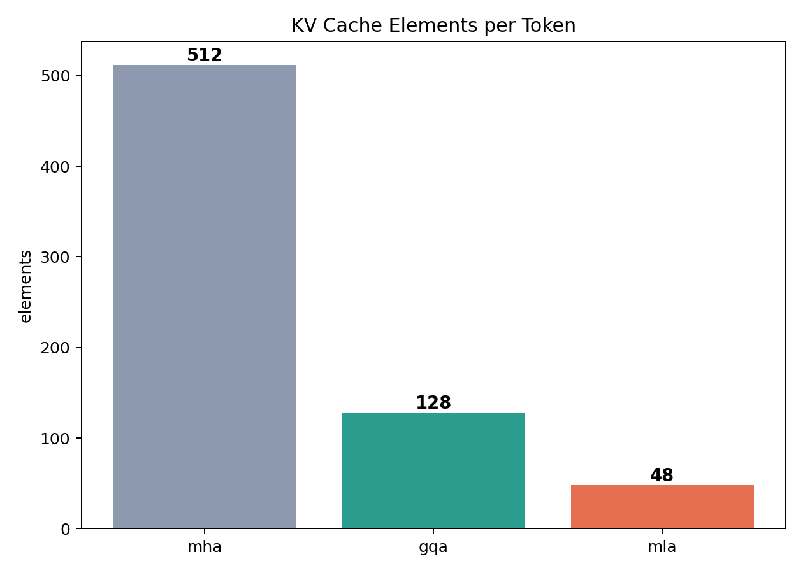

# attn-kv-bench

Attention mechanism & KV cache strategy serving benchmark on a controlled toy transformer.

MHA, GQA, MLA 세 가지 attention 기법과 KV cache 전략(no-cache, contiguous, paged, latent)이 inference 성능에 미치는 영향을 정량 비교한다. 답변 품질 평가는 의도적으로 제외하고, 서빙 경로의 기계적 성능만을 비교한다.

## Engines

| Engine | Attention | KV Cache | KV elements/token |
|--------|-----------|----------|-------------------|
| `baseline_mha_no_cache` | MHA (8 heads) | None (recompute) | 512 |
| `gqa_contiguous_cache` | GQA (2 KV heads) | Contiguous buffer | 128 |
| `gqa_paged_cache` | GQA (2 KV heads) | Paged blocks (16) | 128 |
| `mla_latent_cache` | MLA (rank 48) | Compressed latent | **48** |

## Results

> Apple M5 Pro / MPS, toy transformer (6L, 256d, 8H), 4 sessions x 7 turns, 3 measurement runs

### Latency & Throughput


| Engine | Mean TTFT | Decode TPS | End-to-End | vs Baseline |
|--------|-----------|------------|------------|-------------|
| Baseline MHA | 55.1 ms | 35.8 tok/s | 632.0 ms | - |
| GQA Contiguous | 17.0 ms | 82.6 tok/s | 203.1 ms | TTFT -69%, TPS +131% |
| GQA Paged | 20.2 ms | 76.4 tok/s | 221.3 ms | TTFT -63%, TPS +113% |
| MLA Latent | 18.1 ms | 79.0 tok/s | 211.1 ms | TTFT -67%, TPS +121% |

### KV Cache Memory


| Engine | Peak KV Bytes | vs GQA Contiguous |
|--------|--------------|-------------------|
| GQA Contiguous | 6,488,064 | - |
| GQA Paged | 5,013,504 | -23% |
| **MLA Latent** | **2,433,024** | **-63%** |

### KV Cache Elements per Token



MLA는 KV를 low-rank latent(rank=48)로 압축하여 토큰당 캐시 크기를 MHA 대비 **10.7x**, GQA 대비 **2.7x** 절감한다.

## Key Findings

1. **GQA + KV cache**: Baseline MHA 대비 TTFT 69% 감소, 처리량 131% 증가. KV cache 도입 효과가 지배적
2. **MLA vs GQA**: 처리 속도는 GQA와 동등하면서 KV cache 메모리를 **63% 추가 절감**
3. **Paged vs Contiguous**: PagedAttention은 메모리 23% 절감하나 throughput 소폭 감소 (block 재조립 오버헤드)
4. **MLA trade-off**: decompression 연산(up-projection)이 추가되지만, cache 크기 절감이 메모리 바운드 시나리오에서 유리

## Architecture

```
ToyLM (6 layers, hidden=256, heads=8)
  +-- TransformerBlock x 6
       +-- RMSNorm -> Attention -> RMSNorm -> MLP
       +-- Attention variants:
            StandardAttention (MHA / GQA)
            MLAAttention (low-rank KV compression)
  +-- KV Cache variants:
       ContiguousKVCache  -- dynamic doubling buffer
       PagedKVCache       -- fixed block pool (PagedAttention-style)
       LatentKVCache      -- compressed latent buffer (MLA-specific)
```

### MLA Attention Flow

```
hidden_states [batch, seq, 256]
    |
    +---> q_proj --------------------------> Q [batch, 8, seq, 32]
    |
    +---> kv_down_proj -> [rank=48]           <- cache this (compressed)
              |
          RMSNorm
              |
          kv_up_proj -> per-head K, V         <- decompress at attention time
              |
    Q @ K^T -> softmax -> @ V -> o_proj -> output
```

## Workload

벤치마크 워크로드는 단순 단일 프롬프트가 아니라, 장기 문맥 유지를 요구하는 multi-turn 세션으로 구성된다.

- 4개 세션 x 7개 턴 = 28 samples/run
- 세션 주제: 수조 관찰 라우팅, 프로젝트 로그 분석, 공급망 이상 탐지, 시스템 지연 분석
- 후반부 질문이 앞선 모든 턴의 문맥에 의존하도록 설계하여 KV cache 재사용 효과가 드러나게 함

## Quick Start

```bash
uv sync
uv run python scripts/run_benchmark.py    # 4-engine benchmark
uv run python scripts/run_plots.py        # generate charts
```

## Project Structure

```
kvbench/
  __init__.py
  __main__.py
  config.py          # ModelConfig (MLA params included) + BenchmarkConfig
  tokenizer.py       # ByteTokenizer
  engines.py         # Attention modules + KV caches + 4 serving engines
  benchmark.py       # 4-way benchmark runner
  workload.py        # Multi-turn conversation workloads
  plots.py           # Visualization (3 charts)
scripts/
  run_benchmark.py
  run_plots.py
results/
  benchmark_results.json
  plots/
assets/              # README images
```

## Limitations

- Apple Silicon / MPS 환경 실험이므로 CUDA 절대 수치와 직접 비교 불가
- Toy transformer (6L, 256d) 대상으로 상대 비교 목적
- MLA 구현은 Decoupled RoPE를 생략한 simplified 버전 (KV 압축 효과 검증에 집중)

## References

- [GQA: Training Generalized Multi-Query Transformer Models from Multi-Head Checkpoints](https://arxiv.org/abs/2305.13245)
- [DeepSeek-V2: A Strong, Economical, and Efficient MoE Language Model (MLA)](https://arxiv.org/abs/2405.04434)
- [Efficient Memory Management for Large Language Model Serving with PagedAttention](https://arxiv.org/abs/2309.06180)
